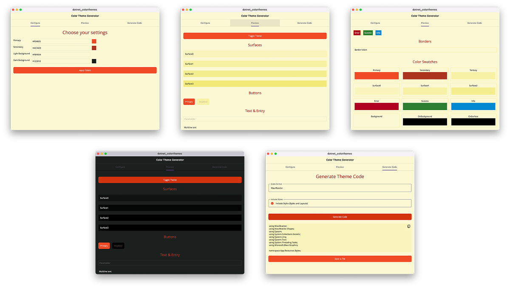

# .NET MAUI Color Themes Generator

A delightful cross-platform application for generating beautiful, consistent color themes for your .NET MAUI apps.

## !!! WORK IN PROGRESS !!!



## 🎨 What is this?

The .NET MAUI Color Themes Generator is a powerful, yet simple tool that helps developers create harmonious color palettes for their .NET MAUI applications. By entering just four colors (primary, secondary, light background, and dark background), it automatically generates a complete theme including:

- Primary and Secondary colors
- Surface variations (Surface0-3)
- Feedback colors (Error, Success, Info)
- Background and foreground colors
- Active and disabled states
- Light and dark theme variants optimized for accessibility

## ✨ Features

- **Customizable Color Inputs**: Enter hex color codes for primary, secondary, light and dark backgrounds
- **Instant Theme Generation**: Create complete color themes from your four base colors
- **Live Preview**: See your theme applied to common MAUI controls in real-time
- **Dark Mode Support**: Customize and preview both light and dark mode variations
- **Multiple Code Formats**: Generate code in various formats:
  - AppThemeColor (XAML)
  - AppThemeBinding with StaticResources (XAML) 
  - Color with DynamicResources (XAML)
  - MauiReactor (C#)
- **Cross-Platform**: Works on Windows, macOS, iOS, and Android

## 🚀 Getting Started

### Prerequisites

- .NET 10 SDK (or later)
- Visual Studio or Visual Studio for Mac (or use the `dotnet` CLI)

### Installation

1. Clone this repository:
   ```
   git clone https://github.com/yourusername/dotnet-colorthemes.git
   ```

2. Open the solution in Visual Studio or build using the dotnet CLI:
   ```
   cd dotnet-colorthemes
   dotnet build src/dotnet-colorthemes.csproj
   ```

3. Run the application:
   ```
   dotnet run --project src/dotnet-colorthemes.csproj
   ```

## 🔍 How to Use

1. **Launch the app** on your preferred platform
2. **Customize your theme** by entering hex color codes for:
   - Primary color (e.g., #FF5722)
   - Secondary color (e.g., #03DAC6)
   - Light background color (for light theme)
   - Dark background color (for dark theme)
3. **Apply colors** by clicking the "Apply Colors" button to see your theme applied immediately
4. **Toggle between light and dark mode** to see how your theme adapts to both modes
5. **Select a code format**:
   - AppThemeColor (Default XAML format)
   - AppThemeBinding with StaticResources (XAML)
   - Color with DynamicResources (XAML)
   - MauiReactor (C#)
6. **Generate code** by clicking the "Generate Code" button
7. **Save the generated file** to include in your .NET MAUI project

## 📋 How to Use the Generated Theme in Your Project

1. **Add the generated XAML or C# file(s)** to your project's Resources/Styles folder
2. **Include the ResourceDictionary** in your App.xaml/cs:

```xaml
<Application.Resources>
    <ResourceDictionary>
        <ResourceDictionary.MergedDictionaries>
            <ResourceDictionary Source="Resources/Styles/ThemeColors.xaml" />
            <!-- Other resource dictionaries here -->
        </ResourceDictionary.MergedDictionaries>
    </ResourceDictionary>
</Application.Resources>
```

3. **Start using the colors** in your XAML (or C#):

> 💡 The generated theme includes both light and dark mode variants automatically!

```xaml
<Button BackgroundColor="{StaticResource Primary}" 
        TextColor="{StaticResource OnPrimary}" 
        Text="Primary Button" />
```

## 🎯 Color Tokens Guide

The generated theme includes the following color tokens:

| Token | Description |
|-------|-------------|
| `Primary` | Main brand color for prominent UI elements |
| `Secondary` | Complementary color for less prominent UI elements |
| `Surface0-3` | Background surfaces with increasing elevation |
| `Background` | Default app background |
| `OnBackground` | Text/icons on the background |
| `OnSurface` | Text/icons on surface colors |
| `Error`, `Success`, `Info` | Semantic colors for notifications and messaging |


## 🤝 Contributing

Contributions are welcome! Please feel free to submit a Pull Request.

1. Fork the repository
2. Create your feature branch (`git checkout -b feature/amazing-feature`)
3. Commit your changes (`git commit -m 'Add some amazing feature'`)
4. Push to the branch (`git push origin feature/amazing-feature`)
5. Open a Pull Request

## 📄 License

This project is licensed under the MIT License - see the LICENSE file for details.

## 🙏 Acknowledgements

- [.NET MAUI](https://github.com/dotnet/maui) - The cross-platform UI framework that makes this app possible
- [Microsoft.Maui.Graphics](https://github.com/dotnet/Microsoft.Maui.Graphics) - For color manipulation capabilities
- [CommunityToolkit.Maui](https://github.com/CommunityToolkit/Maui) - For additional UI components and utilities

---

Happy theming! 🎨✨
